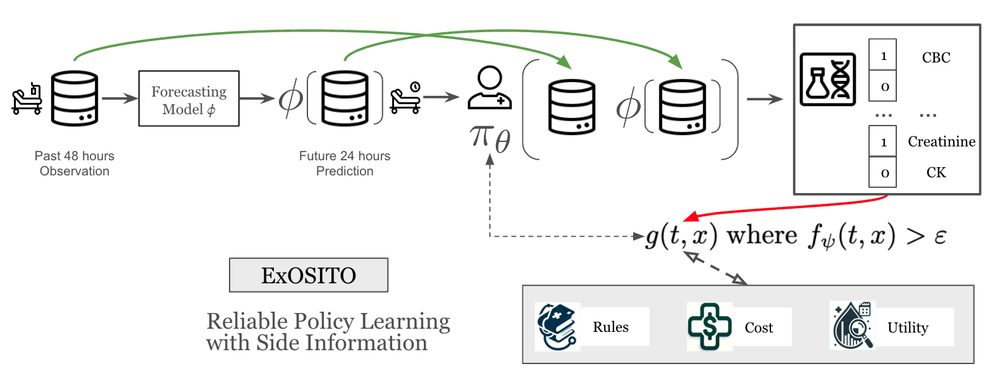

# ExOSITO


*Zongliang (Jerry) Ji, Andre Amaral, Anna Goldenberg, Rahul G. Krishnan* <br>


<p align="center">
  
  <br>
</p>

## Usage

- `src/lto1_get_labval_pred_model.py`: Script for learning patient status forcasting prediction model $\phi$
- `src/lto2_get_gpscnf_model.py`: Script for learning global propensity score fuction $f_\psi$
- `src/lto3_get_laborder_policy.py`: Script for learning labtest order policy $\pi_\theta$ 


## Citation

```bibtex
@article{ji2025exosito,
  title={ExOSITO: Explainable Off-Policy Learning with Side Information for Intensive Care Unit Blood Test Orders},
  author={Ji, Zongliang and Amaral, Andre Carlos Kajdacsy-Balla and Goldenberg, Anna and Krishnan, Rahul G},
  journal={arXiv preprint arXiv:2504.17277},
  year={2025}
}
```